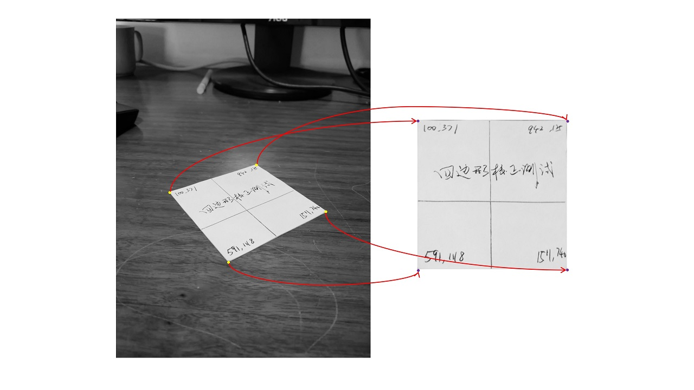
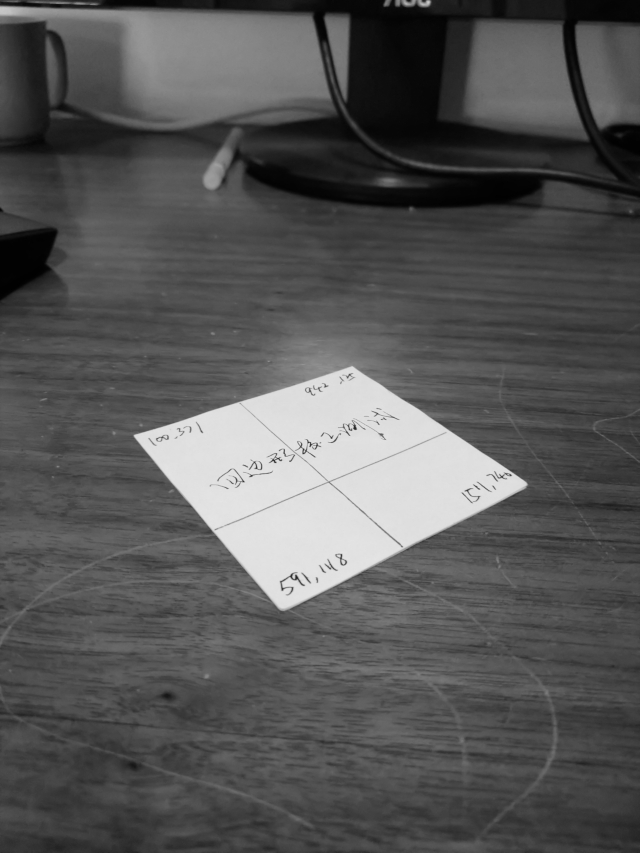
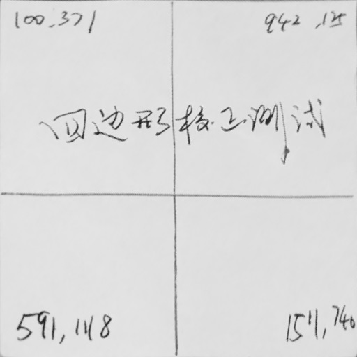
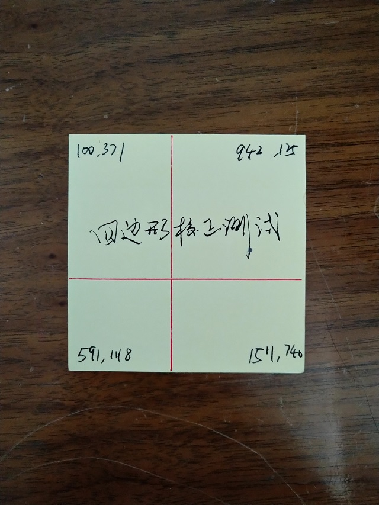

# 功能说明
Image_rect_clipper通过一个C++函数调用将图像中的任一已知的四边形区域剪切成矩形图像，是应朋友的请求做的，给他推荐opencv，但他嫌opencv太笨重，要求用最原始的C++来实现。要求和效果如下图所示：



# 一、基本原理
线性变换加非线性变换，设原图中的四边形四角坐标为已知的(x0, y0)、(x1, y1)、(x2, y2)、(x3, y3)，设目标图像的四角坐标为已知的(u0, v0)、(u1, v1)、(u2, v2)、(u3, v3)。定义坐标变换公式：
```
  x = c0 + c1*u + c2*v + c3*u*v   （1）
  y = c4 + c5*u + c6*v + c7*U*v   （2）
```
将(x0, y0) ~ (x3, y3)和(u0, v0) ~ (u3, v3)代入上述公式，解矩阵求出c0 ~ c7，对于目标矩形图像中的每一个(u,v)坐标，代入公式（1）和（2）即可求出对应于原图中的x，y坐标，再通过双线性或其它插值算法取像素。

公式（1）和（2）的数学意义是说目标图像坐标是原图像像素坐标的一次项以及一个二次项(u\*v)的线性组合，也就是变量之间的多项式拟合，其实二次项还包括u\*u与v\*v，加上它们精度会更高，但是由于四对匹配的坐标只能解出8个系数的方程，所以省去它们。（多项式的次数越高精度越高，但需要的配准坐标点也越多。）

(x,y)与(u,v)之间的多项式变换是双向对等的，如果从原图坐标映射到目标图坐标，需要对像素做逆向差值，处理起来不方便，所以一般用公式（1）和（2）从目标图坐标映射到原图坐标，然后在原图中用插值法取像素。

# 二、源代码说明

- 1. image_trans
```
//将源图像中的一个任意四边形转变换一个正矩形目标图像
//成功返回1
//失败返回0
int image_trans(
	             unsigned char*  psrc,       //原始图像
	             int             src_w,
	             int             src_h,

	             int             src_x[4],   //原始图像中的四边形的角点坐标，按逆时针排列
	             int             src_y[4],

	             unsigned char*  pdst,       //目标图像
	             int             dst_w,
	             int             dst_h)
```
images_trans调用do_matrix_solve解矩阵，do_matrix_solve调用diagonal将矩阵对角化，算上空行共130代码完事。
必须说明的是 src_x[4],  src_y[4]必须构成一个四边形，如果四个点排成一条线，或是两个点重叠退化成三角形，公式（1）和（2）无解，do_matrix_solve返回失败！

- 2. main
加载 [in.bmp](./src/in.bmp)，使用hardcoded的参数调用image_trans输出 [out.raw](./src/out.raw) out.raw可使用以下python脚本显示：
```
    from PIL import Image
    f = open("out.raw", "rb")
    data = f.read(512*512)
    img = Image.frombytes('L', (512, 512), data)
    img.show()
```
下面是in.jpg、out.raw，以及正角度拍摄图的对比：


**in.jpg**


**out.raw**



#### 对比这三张图可以发现，out.raw虽然整体上看不出失真，但仔细观察图中的直线可以看出，in.jpg与origin.jpg中的直线都是直的，而out.raw中的直线局部存在细微弯曲，原因是只用了四个坐标点做配准。
